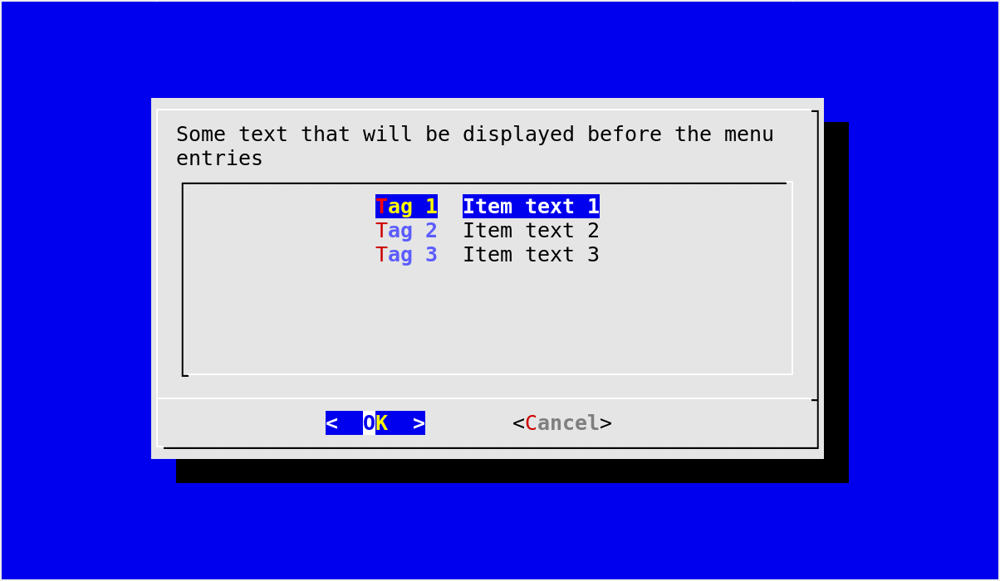

.. currentmodule:: dialog

A gentle introduction
=====================

A minimal program using pythondialog starts with the creation of a
:class:`Dialog` instance::

  import dialog
  from dialog import Dialog

  d = Dialog(dialog="dialog")

The *dialog* parameter indicates the executable to use to invoke the backend
(which must be compatible with dialog_). For instance, one might use something
like ``dialog="/home/dave/src/dialog-1.2-20140219/dialog"``. The default value
is ``"dialog"``, and since it does not contain any slash (``/``), it is looked
up in the :envvar:`PATH`. See :meth:`Dialog.__init__` for a description of all
parameters that can be passed to the :class:`Dialog` constructor.

.. _dialog: http://invisible-island.net/dialog/dialog.html

Once you have a :class:`Dialog` instance, you can call any widget-producing
method, as documented in :ref:`widgets`. For instance, if you want to display
a menu offering three choices::

  code, tag = d.menu("Some text that will be displayed before the menu entries",
                     choices=[("Tag 1", "Item text 1"),
                              ("Tag 2", "Item text 2"),
                              ("Tag 3", "Item text 3")])

When the method returns:

  - *code* will be equal to ``d.OK`` if there was no error and the user chose
    an entry (instead of pressing :kbd:`Esc`). See :ref:`Dialog-exit-code` for
    more details on how to interpret *code*.
  - *tag* will contain the name of the tag corresponding to the selected
    entry: ``"Tag 1"``, ``"Tag 2"`` or ``"Tag 3"`` (assuming that ``code ==
    d.OK``).

   A simple example using :meth:`Dialog.menu`

For a slightly lengthier example, you can look at the
:file:`simple_example.py` file that comes with pythondialog, in the
:file:`examples` directory. It is a very simple and straightforward example
using a few basic widgets. The `pythondialog website
<http://pythondialog.sourceforge.net/>`_ also has a very simple example that
can be used to get started.

Once you are comfortable with the basics, you can study the :file:`demo.py`
file that illustrates most features of pythondialog (also from the
:file:`examples` directory), or more directly :file:`dialog.py`.
